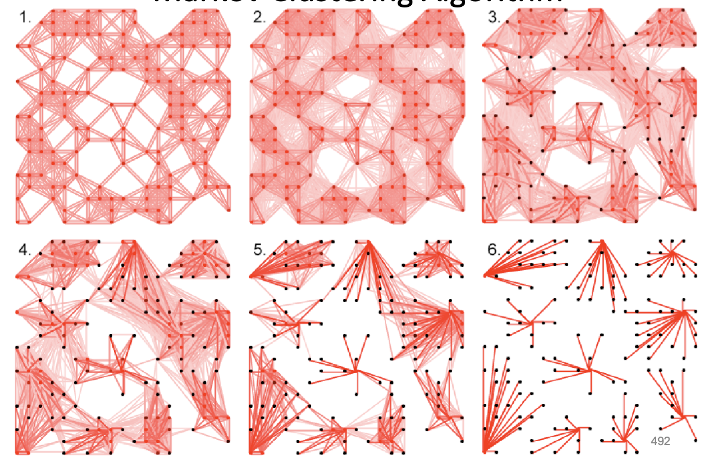

- [Clustering](#clustering)
  - [Clustering problem](#clustering-problem)
  - [\(k\)-center clustering problem](#k-center-clustering-problem)
    - [Complexity](#complexity)
  - [\(k\)-center clustering heuristic](#k-center-clustering-heuristic)
  - [\(k\)-means clustering problem](#k-means-clustering-problem)
    - [Center of gravity theorem](#center-of-gravity-theorem)
    - [Lloyd algorithm (\(k\)-means clustering)](#lloyd-algorithm-k-means-clustering)
    - [Complexity](#complexity-1)
      - [How can you evaluate the results obtained (number of clusters and their relative position) using the k-means algorithm for clustering? [2013P9Q1]](#how-can-you-evaluate-the-results-obtained-number-of-clusters-and-their-relative-position-using-the-k-means-algorithm-for-clustering-2013p9q1)
  - [Soft \(k\)-means clustering](#soft-k-means-clustering)
    - [Expectation maximisation](#expectation-maximisation)
    - [Complexity](#complexity-2)
  - [Hierarchical clustering](#hierarchical-clustering)
    - [Complexity](#complexity-3)
  - [Markov clustering algorithm (MCL)](#markov-clustering-algorithm-mcl)
    - [Method](#method)
    - [Complexity](#complexity-4)
  - [Stochastic neighbour embedding (t-SNE)](#stochastic-neighbour-embedding-t-sne)
    - [Method (key points)](#method-key-points)
  - [Evaluating results obtained using clustering algorithms](#evaluating-results-obtained-using-clustering-algorithms)
    - [\(k\)-means](#k-means)
    - [Markov clustering](#markov-clustering)

# Clustering

* measuring gene expression levels over time
  * usually measured as logarithm of concentration
  * gene expression *vectors*
  * forming gene expression *matrices*
* determining which sets of genes are expressed in similar patterns (and therefore regulated by the same or similar transcription factors)
* genes in the same cluster have similar behaviour, genes in differenct clusters have different behaviour

## Clustering problem

*Partition a set of expression vectors into clusters.*

**Input:** collection of $n$ vectors and integer $k$.

**Output:** partition of $n$ vectors into $k$ disjoint clusters satisfying the clustering principle (that the distances between points in the same cluster are smaller than to the points in other clusters)

* but the distance clustering principle may be not satisfied even if clusters are visually correct
* clustering as finding centers
* iterative algorithm

$$d(\text{DataPoint}, \text{Centers}) = \min_{x \in \text{Centers}} d(\text{DataPoint}, x) $$

$$\text{MaxDistance}(\text{Data}, \text{Centers}) = \max_{\text{DataPoint} \in \text{Data}} d(\text{DataPoint}, \text{Centers})$$

## \(k\)-center clustering problem

*Given a set of points $\text{Data}$, find $k$ centers minimising $\text{MaxDistance}(\text{Data}, \text{Centers})$*

**Input:** $\text{Data}, k$

**Output:** set of $k$ points $\text{Centers}$ that minimises $\text{MaxDistance}(\text{DataPoints}, \text{Centers})$ over all possible choices of $\text{Centers}$

### Complexity

*Intractable.*

## \(k\)-center clustering heuristic
**Farthest first traversal**

1. set *Centers* to the set consisting of single *DataPoint* from *data*
2. while *Centers* have fewer than $k$ points
   1. set *DataPoint* to a point in *Data* maximising $d(\text{DataPoint}, \text{Centers})$ among all data points
   2. add *DataPoint* to *Centers*

Maximal distance does ot do well in extreme cases when there are outliers; we are interested in typical cases ignoring outliers.
* minimise *squared error distortion* instead of maximal distance
* so that all points contribute to it rather than single outlier influences the entire result

## \(k\)-means clustering problem

**Input:** $\text{Data}, k$

**Output:** $k$ points $\text{Centers}$ that minimises $\text{Distortion}(\text{Data}, \text{Centers})$ over all possible choices of $\text{Centers}$

### Center of gravity theorem

*Center of gravity of points in data is the only point solving 1-means clustering problem*

$$\text{Centroid}(\text{Data}) = \sum_{\text{DataPoint}\in\text{Data}} \frac{\text{DataPoint}}{\vert \text{Data}\vert }$$

### Lloyd algorithm (\(k\)-means clustering)

1. Select $k$ arbitrary data points as *Centers* and perform:
2. *Centers to clusters.* Assign data point to cluster corresponding to nearest center (ties broken arbitrarily).
3. *Clusters to centers.* After assignment of data points to $k$ clusters, comput new centers as centers of gravity.
4. Terminate when the points converge (don't need more than $k$ iterations—intuitively the point cannot be reassinged to a new cluster more than $k$ times)
5. Avoid unlucky initialisations which result in wrong clusters using *farthest first traversal* heuristic, pick $k$ points sequentially so that new point has higher probability of being assigned farther away.

### Complexity

Exact solution for $k$-means clustering: *NP-hard* for $k>1$.

* $O(nk)$ for assignment of nearest points to centers
* $O(nk)$ for deriving $k$ new center approximations
* for $I$ iterations in $d$ dimensions, $O(nkdI)$; $I \sim k$

#### How can you evaluate the results obtained (number of clusters and their relative position) using the k-means algorithm for clustering? [2013P9Q1]

* The quality of cluster could be assessed by ratio of distance to nearest cluster and cluster diameter. 
* A cluster can be formed even when there is no similarity between clustered patterns. 
* This occurs because the algorithm forces $k$ clusters to be created.

## Soft \(k\)-means clustering

* Lloyd algorithm assigns points to strictly one cluster
* in soft clustering assign probabilities for each point to be in a certain cluster

### Expectation maximisation

Instead of assigning a point to one cluster, assign *responsibilities* of each point to every cluster. Two iterative steps: *E* and *M*.

* *E-step.* From the arbitrary parameters (centers) compute the (hidden) *responsibility matrix*–how much does each point depend on a particular center point.
  * compute *responsibilities* by borrowing the laws from statistical mechanics
  $$\text{Force}_{ij} = e^{-\beta \cdot d(\text{Data}_j, \text{Center}_i)}$$

  $$\text{HiddenMatrix}_{ij} = \frac{\text{Force}_{ij}}{\sum_j \text{Force}_{ij}}$$
  * *stiffness* parameter $\beta$ determines the flexibility of each datapoint to be between the two clusters; 
    * as $\beta \rightarrow \infty$ approaching hard $k$-means
    * as $\beta = 0$, point uniformly belongs to every cluster
    * as $\beta < 0$, point depends less on each cluster and strives to be independent
* *M-step.* From the responsibility matrix and data points recompute the center points that *maximise?* the probability of every center assignment.

### Complexity
[[Source]](https://stackoverflow.com/questions/14051171/what-is-the-computational-complexity-of-the-em-algorithm)

Pretty much the same as Lloyd algorithm: 

* $O(nkdI)$, for $n$ points, $k$ clusters, $d$-dimensional spaces and $I (\not\sim k)$ iterations. 
* *Note no explicit termination condition*.

## Hierarchical clustering

* Want to know subclusters of each cluster
* Keep recursively dividing the clusters until the desired number of clusters is achieved.
* Can choose different *distance functions* (which give different results)
  * *average distance* between elements in two clusters
  * *minimum distance* between elements in two clusters

### Complexity
Can do this *bottom-up* which reduces to solving UPGMA, with complexity $O(n^3)$.

## Markov clustering algorithm (MCL)
*Dense clusters correspond to regions with a large number of paths.*

E-M algorithm but with matrix multiplication. Multiply the matrix by itself to emphasise the "path density"; then prune regions with small path density (e.g. below some threshold). This leaves some densely connected regions which correspond to clusters.

* Take random walk described by *similarity matrix*
* After each step weaken distant node links, strengthen nearby links
* *Expansion* and *inflation* steps to emphasise the paths *within* the cluster than the paths that would *leave* the cluster.
  * expansion parameter $r$
  * influences *granularity* of clusters

### Method
1. Input undirected graph; *power* parameter $e=2$, *inflation* parameter $r=2$.
2. Create associated adjacency matrix
3. Normalise matrix:
$$M_{pq}' = \frac{M_{pq}}{\sum_i M_{iq}}$$
4. *Expand* by taking $e$-th power of matrix:
$$M \leftarrow M^e$$
5. *Inflate* matrix with inflation parameter $r$:
$$M_{pq}=\frac{(M_{pq})^r}{\sum_i (M_{iq})^r}$$
6. Repeat until convergence (in practice 10-100 steps, fewer if sparse matrix).

### Complexity

* Matrix multiplication (*expansion*) $O(n^3)$
* *Inflation* $O(n^2)$
* Generally $O(n^3)$ but the matrices are *generally sparse* which improves the speed as most entries are pruned.

## Stochastic neighbour embedding (t-SNE)

* Take points in high-dimensional space and faithfully represent them in two-dimensional space *preserving the relative distances* between points.
* Adapts to the underlying data and cannot be applied to new points as they are added to the dataset.
* Has a *perplexity* parameter which corresponds to the number of local neighbours that a point is expected to have—balancing attention between local and global aspects of the space.
  * Perplexity can *significantly affect the results and might be misleading*. It is best to display the data at several perplexities before inferring anything about the cluster structure.

### Method (key points)
1. Convert high-dimensional similarity to *probability* one data point will pick the other as neighbour.
   1. Use pairwise distances in low-dimensional map to define that probability
   2. Kullback-Leibler divergence between probabilities in high- and low-dimensional spaces
   3. Each point in high dimension has conditional probability of picking other points as neighbours
      1. constructing conditional probabilities representing similarity between high-dimensional data points using Euclidean distances
      $$p_{j\vert i} = \frac{e^{(\frac{-\Vert x_i-x_j\Vert ^2}{2\sigma_i^2})}}{\sum_{k\neq i} e^{\frac{-\Vert x_i-x_j\Vert ^2}{2\sigma_i^2}}}$$
      2. probability $x_i$ would define $x_j$ as neighbour
      3. neighbourhood defined by Gausian pdf centered at $x_i$ and variance $\sigma_i^2$
      4. large $p_{j\vert i}$ indicates close/similar data points
      5. small $p_{j\vert i}$ indicates that $x_j$ is not likely to be a neighbour of $x_i$
      6. $t$-SNE assumes the Student's $t$ distribution instead of the Gaussian for higher efficiency.
   4. Distribution over neighbours based on high-dimensional pairwise distances

TODO more details on t-SNE with equations if needed

* heavy-tailed Student's $t$ mitigates the issue of high-dimensional data where there might be too many points in small low-dimensional space so they cannot be faithfully plotted
* converts moderate distance points to greater distance, separating non-neighbouring points

## Evaluating results obtained using clustering algorithms

### \(k\)-means

* for $k$-means, quality of cluster results could be assessed by ratio of the distance to the nearest cluster and the cluster diameter
* this is important because $k$ clusters are forced by the algorithm, which makes it possible to create clusters of unrelated nodes
* could also use clustering cost (?)

$$C = \sum_{n \rightarrow c_i} (X_n - c_i)^2$$

### Markov clustering

* could use clustering entropy, which indicates the stability of clustering and could be compared in clusters obtained from different clustering granularity parameters
$$S = -\frac{1}{L}\sum_{ij}[M_{ij} \log_2(M_{ij}) + (1-M_{ij}) \log_2(1-M_{ij})]$$
