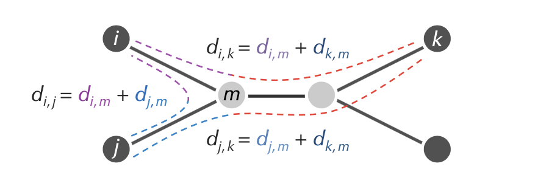
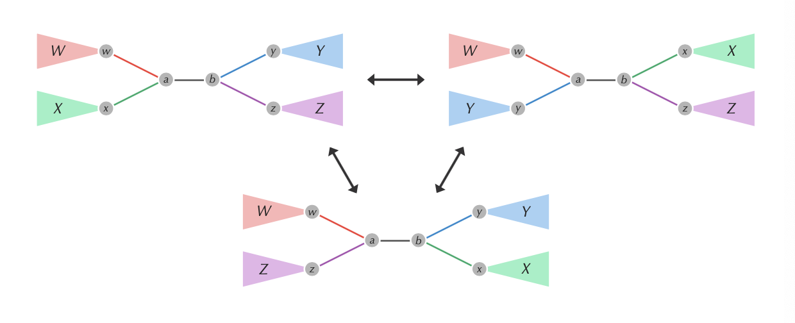

# Phylogeny
- [Phylogeny](#phylogeny)
  - [Distance-based phylogeny problem](#distance-based-phylogeny-problem)
    - [Methods](#methods)
  - [Additive phylogeny](#additive-phylogeny)
    - [Assumptions and conditions](#assumptions-and-conditions)
    - [Computing limb length](#computing-limb-length)
    - [Method](#method)
    - [Complexity](#complexity)
  - [UPGMA (Unweighted pair group with arithmetic mean)](#upgma-unweighted-pair-group-with-arithmetic-mean)
    - [Description](#description)
    - [Method](#method-1)
    - [Complexity](#complexity-1)
  - [Neighbour-joining](#neighbour-joining)
    - [Definitions](#definitions)
    - [Neighbour-joining theorem](#neighbour-joining-theorem)
    - [Method](#method-2)
    - [Complexity](#complexity-2)
  - [Small parsimony](#small-parsimony)
    - [Character based reconstruction](#character-based-reconstruction)
    - [Method (Sankoff parsimony)](#method-sankoff-parsimony)
    - [Complexity](#complexity-3)
  - [Small parsimony in an unrooted tree](#small-parsimony-in-an-unrooted-tree)
  - [Large parsimony](#large-parsimony)
    - [Small vs large parsimony](#small-vs-large-parsimony)
    - [Likelihood-based method](#likelihood-based-method)
    - [The (greedy) heuristic (nearest neighbours of a tree problem)](#the-greedy-heuristic-nearest-neighbours-of-a-tree-problem)
    - [Method (nearest neighbour interchange heuristic)](#method-nearest-neighbour-interchange-heuristic)
    - [Method (validation/boostrap/max-likelihood algorithm)](#method-validationboostrapmax-likelihood-algorithm)
    - [Advantages/disadvantages of max-likelihood methods](#advantagesdisadvantages-of-max-likelihood-methods)
    - [Complexity](#complexity-4)
  - [Multiple alignment](#multiple-alignment)
    - [Complexity](#complexity-5)
  - [Progressive alignment](#progressive-alignment)
    - [Pairwise alignment](#pairwise-alignment)
    - [Method (CLUSTALW)](#method-clustalw)
    - [Complexity](#complexity-6)

## Distance-based phylogeny problem
*Construct an evolutionary tree from a distance matrix.*

**Input**: distance matrix

**Output**: unrooted tree fitting the distance matrix

### Methods

1. Construct distance matrix based on *edit distance in pairwise alignment* or similar methods to retrieve the distance matrix.
2. Use [Additive phylogeny](#additive-phylogeny), [UPGMA](#upgma-unweighted-pair-group-with-arithmetic-mean) or [Neighbour-Joining](#neighbour-joining) algorithm to construct a tree fitting the distance matrix (noting the properties of the distance matrix each method requires).
   1. Either fit the tree exactly or *minimise the discrepancy (square root error)* between observed distances and tree-based distances.

## Additive phylogeny

[Implementation](https://github.com/kamilest/ii-bioinformatics/tree/master/problems/BA7C)

**Input:** an additive distance matrix $D$.

**Output:** unrooted simple phylogenetic tree fitting the distance matrix.

### Assumptions and conditions
* An *additive matrix* is a distance matrix such that there exists an unrooted tree fitting it.
  * Must satisfy the *four-point condition*
    * $M_{ik} + M_{jl} = M_{il} + M_{jk} \geq M_{ij} + M_{kl}$
    * $d_{ij} + d_{kl} \leq \max({d_{ik}+ d_{ji}, d_{il}+d_{jk}})$
* *Simple tree*: no nodes of degree 2 (each node is either a leaf or has 3 neighbours)
* A matrix $M$ is *metric* when:
  * it is symmetric
  * satisfies triangle inequality: $\forall i,j,k.\ M_{ij} + M_{jk} \geq M_{ik}$

Interested in fitting *unique simple* trees to an *additive* matrix.

* every distance between nodes is positive and total distance between nodes is equal to the sum of the distances along the path between the two nodes

**Theorem:** Every simple tree with at least two nodes has at least one pair of neighbouring leaves.

### Computing limb length
**Theorem:** Limb length for $i$ is equal to the minimum value of 
$$\frac{D_{i, k} + D_{i,j} - D_{j,k}}{2}$$
over all leaves $j$ and $k$, where $D$ is the distance matrix.

$$d_{i, m} = \frac{D_{i, k} + D_{i, j} - D_{j, k}}{2}$$

### Method
1. Pick an arbitrary leaf $j$.
2. Compute its limb length.
3. Subtract limb length of $j$ from each row and column to produce $D^{\text{bald}}$ in which $j$ is a bald limb of length 0.
4. Remove $j$-th row and column of the matrix to form the smaller matrix $D^{\text{trim}}$.
5. Recursively fit the tree for $D^{\text{trim}}$.
6. Identify the point in the constructed tree where leaf $j$ should be attached.
   1. Use the limb lenght theorem for the bald matrix $D^{\text{bald}}$ where the limb length for $j$ should be 0.
   2. The attachment point for $j$ is found on the path between leaves $i$ and $k$ at distance $D^{\text{bald}}_{i,j}$ from $i$.
   $$D^{\text{bald}}_{i,j} + D^{\text{bald}}_{j, k} = D^{\text{bald}}_{i,k}$$
7. Attach $j$ by an edge of limb length in order to form the overall tree.

### Complexity
* Time: $O(n^3)$ for $n$ leaves.
  * $O(1^2 + 2^2 + \dots + n^2) \sim O(n^3)$
  * at each step $O(n^2)$ to find the limb length (checking all combinations of other leaves)
  * finding if every combination of leaves adds up to the 
* Space: $O(n^2)$.
  
## UPGMA (Unweighted pair group with arithmetic mean)
Also known as *hierarchical clustering.*

**Input:** an arbitrary distance matrix $D$.

**Output:** a rooted *ultrametric* tree minimising the discrepancy between its edge weights and the distance matrix.

### Description
Additive phylogeny works for **additive matrices** only but it is a problem since most of the matrices are not additive.

UPGMA is a more generic algorithm giving a tree *approximately* fitting *any* matrix but can be incorrect.

* constructs a *rooted binary tree*
* edge weights correspond to the *difference* in ages of the nodes the edge connects
* builds the correct tree if the *distance matrix is ultrametric* 

A tree is *ultrametric* iff the *three-point condition* is satisfied:

* $\forall i,j,k.\ M_{ik} = M_{jk} \geq M_{ij}$
* distance from any ancestor to its leaves is the same and it is greater than the distance between the leaves

Weaknesses of UPGMA:

* *molecular clock assumption*: implies time is constant for all species (i.e. the current species have the same age from the ancestor); however, certain species evolve much faster
* typically gives a poor tree

### Method
Works by the same principle as Kruskal's MST algorithm (forming clusters between the closest neighbours)
1. Form a cluster for each present day species, each containing a single leaf
2. Find two closest clusters $C_1$ and $C_2$ according to *average distance*: $D_{\text{avg}}(C_1, C_2) = \frac{\sum_{i \in C_1, j\in C_2}D_{ij}}{\vert C_1\vert \vert C_2\vert }$
3. Merge $C_1$ and $C_2$ into a single cluster $C$.
4. Form a new node for $C$ and connect to $C_1$ and $C_2$ by an edge. Set age of $C$ as $D_{\text{avg}}(C_1, C_2)/2$
5. Update distance matrix by computing the average distance between each pair of clusters (replace $C_1$ and $C_2$ in the distance matrix by the new merged cluster with new distances).
6. Iterate until a single cluster contains all species.

### Complexity
* Time: $O(n^3)$.
* Space: $O(n^2)$.

## Neighbour-joining

**Inputs:** an arbitrary distance matrix $D$.

**Outputs:** an unrooted tree minimising the discrepancy between itself and the matrix.

### Definitions

Given an $n\times n$ distance matrix $D$ its *neighbour-joining matrix* is the matrix $D^*$ defined as 

$$D^*_{ij}= (n-2)D_{ij} - \mathrm{TotalDistance}_D(i) - \mathrm{TotalDistance}_D(j)$$

where $\mathrm{TotalDistance}_D(i)$ is the sum of distances from $i$ to all other leaves. 

### Neighbour-joining theorem

If $D$ is *additive*, then the smallest element of $D^*$ corresponds to neighbouring leaves in $\mathrm{Tree}(D)$.

### Method
1. Construct neighbour-joining matrix $D^*$ from $D$.
2. Find a minimum element $D^{*}_{ij}$ of $D^{*}$.
3. Compute 
   $$\Delta_{ij} = \frac{\mathrm{TotalDistance}_D(i) - \mathrm{TotalDistance}_D(j)}{n-2}$$
4. Set $\mathrm{LimbLength}(i)=\frac{D_{ij} +\Delta_{ij}}{2}$ and $\mathrm{LimbLength}(j)=\frac{D_{ij}-\Delta_{ij}}{2}$.
5. Form a matrix $D'$ by removing $i$-th and $j$-th rows and columns from $D$ and adding an $m$-th row/column such that $\forall k. D_{km}=\frac{D_{ik} + D_{jk} - D_{ij}}{2}$ (corresponding to the limb length formula in AdditivePhylogeny)
6. Apply neighbour-joining algorithm recursively to $D'$ to obtain $\mathrm{Tree}(D')$.
7. Reattach limbs of $i$ and $j$ to obtain $\mathrm{Tree}(D)$.

### Complexity
Neighbour-joining on a set of $n$ taxa requires $n-3$ iterations. 

* At each step one has to build and search a $D^*$ matrix. 
* Initially the matrix is size $n^2$, 
* then the next step it is $(n-1)^2$, etc. 
* Implementing this in a straightforward way leads to an algorithm with a time complexity of $O(n^{3})$.

## Small parsimony

*Find the most parsimonious labelling (lowest parsimony score) of internal nodes of a rooted tree.*

**Input:** rooted binary tree with each leaf labeled by a string of length $m$.

**Output:** labeling of all other nodes of the tree by strings of length $m$ that *minimises the parsimony score.*

### Character based reconstruction

* distance-based algorithms for evolutionary tree do not say anything about the ancestral states
* lost information as *multiple alignment is converted to distance matrix*
* want to reconstruct the tree based on raw information which was used for creating distances (e.g. genetic sequences)

**Parsimony score.** Sum of *Hamming* distances along each edge in the tree where the leaves are genetic sequences of current species.

### Method (Sankoff parsimony)
Could think of this as symbol-wise or (vectorised to) the whole string at once.

Dynamic programming algorithm
1. Let $T_v$ be the subtree of $T$ whose root is $v$.
2. Define $s_k(v)$ as the *minimum parsimony score* of $T_v$ over all labelings of $T_v$, assuming $v$ is labeled by $k$.
3. The minimum parsimony score for the tree is equal to the minimum value of $s_k(\text{root})$ over all symbols $k$.

Recurrence relation:
$$s_k(v) = \min_{\text{symbols}\ i}[s_i(\text{Daughter}(v)) + \delta_{ik}] + \min_{\text{symbols}\ i}[s_i(\text{Son}(v)) + \delta_{ik}]$$
   
### Complexity

* $O(mnk^2)$ for tree with $m$ species, $n$ characters, $k$ states (length of string for each species); 
  * arbitrary scoring matrix with some mutations more likely than others
* $O(mnk)$ if each mutation has the same cost (Walter-Fitch)
  * *Fitch algorithm* solves small parsimony but not covered (I think)
    * union/intersection algorithm (look up MIT slides or similar)

## Small parsimony in an unrooted tree 
*Find the most parsimonious labelling of the internal nodes of an unrooted tree.*

**Input:** unrooted binary tree with each leaf labelled by a string of length $m$

**Output:** position of the root and labelling of all other nodes of the tree by strings of length $m$ that minimises the parsimony score

## Large parsimony

*Given a set of strings, find a tree (with leaves labeled by these strings) having a minimum parsimony score.*

**Input:** collection of strings of equal length

**Output:** rooted binary tree $T$ that minimises the parsimony score among all possible rooted binary trees with leaves labeled by these strings.

### Small vs large parsimony

* small parsimony finds *symbols* (of internal nodes) that minimise the score of the tree
* large parsimony *finds the tree*
  * *Generally NP-complete.*

### Likelihood-based method
Probabilistic tree proposal and scoring: maximise the likelihood of the tree. Based on a *heuristic search* of the max-likelihood tree.

### The (greedy) heuristic (nearest neighbours of a tree problem)

*Given an edge in a binary tree, generate two neighbours of this tree.*

**Input:** internal edge in a binary tree

**Output:** two nearest neighbours of this tree given the internal edge

* removing internal edge (connecting two internal nodes) produces four subtrees $W$, $X$, $Y$, $Z$.
* rearranging subtrees: *nearest neighbour interchange*
  * think of it as *sets* of subtrees on each side
  * could be $(W, X)$, $(W, Y)$ or $(W, Z)$
  * 

### Method (nearest neighbour interchange heuristic)
1. Set current tree equal to an *arbitrary* binary rooted tree.
2. Go through internal edges and *perform all* possible *nearest neighbour interchanges*.
3. Solve *Small parsimony problem* on each tree.
4. If any tree *improves the score* set it equal to the current tree. Otherwise return current tree.

### Method (validation/boostrap/max-likelihood algorithm)
1. Resample subsequences from each of the $m$ sequences and construct phylogenetic trees using the greedy methods.
2. Topologies are compared between trees, looking if the same edges appear in the resampled subsequence trees.
3. Resampling sites and tree reconstruction is repeated several hundred times
4. The percentage of times interior branch is assigned is noted: *bootstrap value*
5. If the bootstrap value is above some threshold (95%) then it is deemed correct and existing in the true tree.

### Advantages/disadvantages of max-likelihood methods
* Advantages:
  - Inherently statistical and evolutionary model-based.
  - Usually the most ‘consistent’ of the methods available.
  - Used for both character and rate analyses
  - Can be used to infer the sequences of the extinct ancestors. 
  - Account for branch-length effects in unbalanced trees.
  - Nucleotide or amino acid sequences, other types of data.
* Disadvantages:
  - Not as intuitive as parsimony (e.g. may choose more events
  if they’re more likely in our probabilistic model)
  - Computationally intense (Iimits num taxa, sequence length).
  - Like parsimony, can be fooled by high levels of homoplasy.
  - Violations of model assumptions can lead to incorrect trees.

### Complexity

Time: $O(mnk^2)$ per iteration (for tree with $m$ species, $n$ characters, $k$ states (length of string for each species—if costs for different mutations are different and all combinations need to be kept))

The iterations depend on how many times the nearest-neighbour interchange heuristic is performed, how many times the subsequences are resampled.

## Multiple alignment
* Aligning $n$ sequences can be seen as a path in $n$-dimensional space.
* For 3D paths, 7 possible directions to choose to fill the scoring matrix
  * **Complexity** $O(7n^3)$ for 3 sequences of length $n$

### Complexity
$k$-way alignment with $k$-dimensional Manhattan graph

* $n^k$ nodes
* most nodes have $2^k-1$ incoming edges
* time complexity: $O(2^k n^k)$

## Progressive alignment
* *Heuristic* methods in nature
* CLUSTAL is one of the most widely used
* Pairwise alignment—guide tree—iterative multiple alignment
  * guide tree is determined by the distance-based phylogenetic tree (neighbour-joining) and helps to detect which sequences are the closest and should be aligned first
  * guide tree construction using midpoint rooting
  * then align the ancestral node label with the next closest sequence
* find conserved patterns across sequences that may indicate functional constraints–if the sequence preserved across different species, indicates important functional role

### Pairwise alignment
*Given a set of arbitrary pairwise alignments, construct a multiple alignment that includes them.*

### Method (CLUSTALW)
1. Given $n$ sequences, align each sequence against each other
2. Use the score of pairwise alignment to compute a *distance matrix*
3. Build a guide tree fitting the distance matrix (using e.g. Neighbour-Joining)
4. Progressive alignment guided by the tree

Not all pairwise alignments build well into a multiple sequence alignment.

* progressive alignment builds final alignment by *merging sub-alignments (bottom-up)* with a guide tree

### Complexity
For $n$ taxa (species)

* Pairwise alignment: $O(n^2k^2)$ for strings of length $k$
* Guide-tree building (e.g. using Neighbour-joining algorithm): $O(n^3)$
* Additional alignment merging: $O(k^2)$
