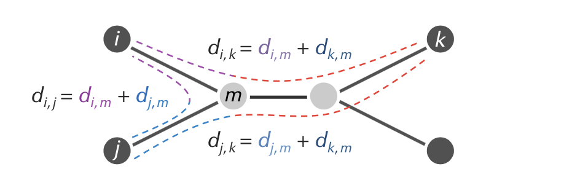
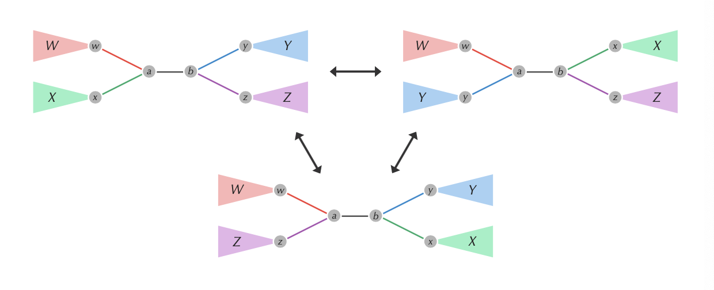
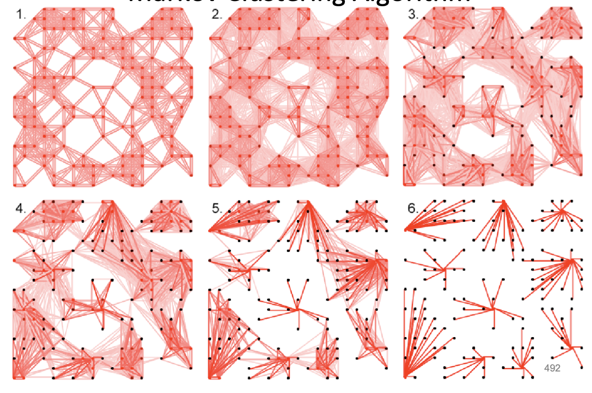

# Bioinformatics syllabus

- [Bioinformatics syllabus](#bioinformatics-syllabus)
- [Alignment lectures](#alignment-lectures)
  - [Longest common subsequence](#longest-common-subsequence)
  - [Needleman-Wunsch](#needleman-wunsch)
    - [Global alignment problem](#global-alignment-problem)
    - [Method](#method)
    - [Overlap detection variant](#overlap-detection-variant)
  - [Smith-Waterman](#smith-waterman)
    - [Local alignment problem](#local-alignment-problem)
    - [Method](#method-1)
  - [Affine gap](#affine-gap)
    - [Simulating affine gaps by long edges](#simulating-affine-gaps-by-long-edges)
  - [Banded dynamic programming](#banded-dynamic-programming)
  - [Hirschberg algorithm](#hirschberg-algorithm)
    - [Middle edge in linear space problem.](#middle-edge-in-linear-space-problem)
  - [Nussinov RNA folding algorithm](#nussinov-rna-folding-algorithm)
- [Phylogeny](#phylogeny)
  - [Distance-based phylogeny](#distance-based-phylogeny)
    - [Distance-based phylogeny problem](#distance-based-phylogeny-problem)
  - [Additive phylogeny](#additive-phylogeny)
    - [Computing limb length](#computing-limb-length)
    - [Method](#method-2)
      - [Complexity](#complexity)
  - [UPGMA (Unweighted pair group with arithmetic mean)](#upgma-unweighted-pair-group-with-arithmetic-mean)
    - [Method](#method-3)
      - [Complexity](#complexity-1)
  - [Neighbour-joining](#neighbour-joining)
    - [Method](#method-4)
      - [Complexity](#complexity-2)
  - [Small (Fitch) parsimony](#small-fitch-parsimony)
      - [Character based reconstruction](#character-based-reconstruction)
    - [Method (Sankoff parsimony)](#method-sankoff-parsimony)
      - [Complexity](#complexity-3)
    - [Small parsimony in an unrooted tree](#small-parsimony-in-an-unrooted-tree)
  - [Large parsimony](#large-parsimony)
    - [Small vs large parsimony](#small-vs-large-parsimony)
    - [Greedy heuristic](#greedy-heuristic)
    - [Nearest neighbours of a tree problem](#nearest-neighbours-of-a-tree-problem)
    - [Method (nearest neighbour interchange heuristic)](#method-nearest-neighbour-interchange-heuristic)
    - [Method (validation/boostrap algorithm)](#method-validationboostrap-algorithm)
    - [Advantages/disadvantages of maximum likelihood methods](#advantagesdisadvantages-of-maximum-likelihood-methods)
      - [Complexity](#complexity-4)
  - [Multiple alignment](#multiple-alignment)
      - [Complexity](#complexity-5)
    - [Pairwise alignment](#pairwise-alignment)
    - [Progressive alignment](#progressive-alignment)
      - [Method (CLUSTALW)](#method-clustalw)
- [Genome sequencing](#genome-sequencing)
  - [Genome sequencing problem](#genome-sequencing-problem)
  - [String reconstruction](#string-reconstruction)
    - [Hamiltonian Path](#hamiltonian-path)
      - [Complexity](#complexity-6)
    - [Eulerian Path](#eulerian-path)
    - [De Bruijn graphs](#de-bruijn-graphs)
      - [Complexity (graph construction)](#complexity-graph-construction)
    - [Euler's theorem](#eulers-theorem)
    - [Method (Hierholzer)](#method-hierholzer)
      - [Complexity](#complexity-7)
  - [Read-pair assembly](#read-pair-assembly)
    - [String reconstruction from read-pairs](#string-reconstruction-from-read-pairs)
    - [Method (paired de Bruijn)](#method-paired-de-bruijn)
  - [Constraints](#constraints)
- [Clustering](#clustering)
    - [Clustering problem](#clustering-problem)
    - [$k$-center clustering problem](#math-xmlns%22httpwwww3org1998mathmathml%22semanticsmrowmikmimrowannotation-encoding%22applicationx-tex%22kannotationsemanticsmathk-center-clustering-problem)
      - [Complexity](#complexity-8)
    - [$k$-center clustering heuristic](#math-xmlns%22httpwwww3org1998mathmathml%22semanticsmrowmikmimrowannotation-encoding%22applicationx-tex%22kannotationsemanticsmathk-center-clustering-heuristic)
    - [$k$-means clustering problem](#math-xmlns%22httpwwww3org1998mathmathml%22semanticsmrowmikmimrowannotation-encoding%22applicationx-tex%22kannotationsemanticsmathk-means-clustering-problem)
      - [Complexity](#complexity-9)
    - [Center of gravity theorem](#center-of-gravity-theorem)
  - [Lloyd algorithm ($k$-means clustering)](#lloyd-algorithm-math-xmlns%22httpwwww3org1998mathmathml%22semanticsmrowmikmimrowannotation-encoding%22applicationx-tex%22kannotationsemanticsmathk-means-clustering)
      - [Complexity](#complexity-10)
    - [Soft $k$-means clustering](#soft-math-xmlns%22httpwwww3org1998mathmathml%22semanticsmrowmikmimrowannotation-encoding%22applicationx-tex%22kannotationsemanticsmathk-means-clustering)
    - [Expectation maximisation](#expectation-maximisation)
      - [Complexity](#complexity-11)
  - [Hierarchical clustering](#hierarchical-clustering)
  - [Markov clustering algorithm (MCL)](#markov-clustering-algorithm-mcl)
    - [Method](#method-5)
      - [Complexity](#complexity-12)
  - [Stochastic neighbour embedding (t-SNE)](#stochastic-neighbour-embedding-t-sne)
    - [Method (key points)](#method-key-points)
- [Genomics pattern matching](#genomics-pattern-matching)
  - [Single pattern matching problem](#single-pattern-matching-problem)
  - [Multiple pattern matching problem](#multiple-pattern-matching-problem)
      - [Brute force approach complexity](#brute-force-approach-complexity)
  - [Using tries for pattern matching](#using-tries-for-pattern-matching)
  - [Suffix tree compression](#suffix-tree-compression)
  - [Burrows-Wheeler transform](#burrows-wheeler-transform)
    - [Method](#method-6)
- [Hidden Markov Models](#hidden-markov-models)
  - [Three problems of HMMs](#three-problems-of-hmms)
    - [Probability of a hidden path](#probability-of-a-hidden-path)
    - [Probability of an outcome given a hidden path](#probability-of-an-outcome-given-a-hidden-path)
  - [Viterbi algorithm](#viterbi-algorithm)
    - [Decoding problem](#decoding-problem)
  - [Forward-Backward algorithm](#forward-backward-algorithm)
    - [Outcome likelihood problem](#outcome-likelihood-problem)
  - [Backward algorithm](#backward-algorithm)
  - [Baum-Welch learning](#baum-welch-learning)
    - [Assumptions -->](#assumptions)

# Alignment lectures

* Align genome and protein sequences
* Detect differences at the single base to block of bases
* RNA: aligning molecule with itself
* *Dynamic programming algorithms*
* BA Chapter 5


## Longest common subsequence

https://github.com/kamilest/ii-bioinformatics/tree/master/BA5C

**Given**: Two strings.

**Return**: A longest common subsequence of these strings.

**Complexity**: $O(nm)$ for sequences of length $n$ and $m$ (DP algorithm)

* Allow only insertions and deletions but no mismatches
* Scoring matrix initialise to 0
* +1 for matches, 0 for indels
* Aim for the maximal number of symbols for strings `v` and `w` such that `v_t = w_t`
* Edit distance over Hamming distance–DP method of solving through edit graphs


## Needleman-Wunsch

https://github.com/kamilest/ii-bioinformatics/tree/master/BA5E

### Global alignment problem
*Find the highest-scoring alignment between two strings using a scoring matrix.*

**Given**: Two amino acid strings and a scoring matrix.

**Return**: The maximum alignment score of these strings followed by an alignment achieving this maximum score. 

**Complexity**

* Space: $O(mn)$
* Time: $O(mn)$
* Backtrace: $O(m+n)$

### Method

* Initialise first row and column to the `cells to source * penalty`
* Dynamic programming: highest score between
  * indel
  * match or mismatch
* Backtrack as appropriate: left, right, diagonal step. Going back through the coordinates from sing to source returns the original path.

### Overlap detection variant
* Can have unlimited number of gaps at the beginning and the end of the sequence 
* Initialise first row and column to 0

## Smith-Waterman

https://github.com/kamilest/ii-bioinformatics/tree/master/BA5F

### Local alignment problem
*Find the highest-scoring local alignment between two strings.*

**Given**: Two amino acid strings and a scoring matrix.

**Return**: The maximum score of a local alignment of the strings, followed by a local alignment of these strings achieving the maximum score.

**Complexity**:

* Space: $O(mn)$
* Time: $O(mn)$
* Backtrace: $O(m+n)$

### Method

* Initialise first row and column to 0
* Dynamic programming: highest score between
  * 0
  * indel
  * match or mismatch

## Affine gap

* Fixed penalty $\sigma$ might be a problem
* Affine gap penalty for gap lenth $k$: $\sigma + \varepsilon(k-1)$
  * $\sigma$ gap opening penalty
  * $\varepsilon$ gap extension penalty
  * $\sigma > \varepsilon$ opening gap is more expensive than extending
* Use three levels of backtracking matrices
  * Lower level for insertions (down arrows)
  * Middle for matches/mismatches (diagonal arrows)
  * Upper level for deletions (right arrows)
* Lower and upper level penalties are $\varepsilon$ as they account for extensions
* Switching from middle level to lower/upper costs $\sigma$ gap opening penalty
* Going back from gap extension levels back to the same node in middle level does not cost anything
  * middle level updates to max of previous middle + score/same node in lower/same node in uppter
  * lower and uppter update to max of lower/upper + $\varepsilon$/middle level + $\sigma$

### Simulating affine gaps by long edges

* $F$ scoring matrix would compute matches/gap opening/gap close (score from $G$ plus score of match)
* $G$ scoring matrix would compute gap extensions
* to remember overall optimal alignment need to know the best alignment if gap is still open or if gap is closed

**Complexity** (alignment with gaps):

* Time $O(N^2M)$ for $N > M$
* Space $O(NM)$

## Banded dynamic programming
* assume strings are already similar and have few insertions/deletions
* update scorings within some distance from the diagonal ($|i-j| < k(N)$)

**Complexity**:

* Time $O(N \cdot k(N)) \ll O(N^2)$

## Hirschberg algorithm
Computing alignment with linear memory

* Use two columns at a time and throw away others
* Detect middle edge based on where the score is highest in the middle column (forward and reverse)
* Recursively compute other midpoints, throwing the rest of the scoring matrix away

### Middle edge in linear space problem.
*Find a middle edge in the alignment gap in linear space.*

**Input**: Two strings and scoring matrix.

**Output**: Middle edge in the alignment graph of these strings

**Complexity**:

* Time $O(nm)$
* Space $O(n)$

## Nussinov RNA folding algorithm
* DP matrix tracking the maximum number of bonds if the inner string between the two indices in the matrix folds optimally 
* if $i < j$:
  1. $x_i$ paired with $x_j$:
     1. $F(i, j) = s(x_i, x_j) + F(i+1, j-1)$
     2. score of folding of $x_i$ and $x_j$ as substring from $i+1$ to $j-1$ folds optimally
  2. $x_i$ is not paired with $x_j$:
     1. $F(i, j) = \mathrm{max}\{k: i \leq k < j\}\ F(i, k) + F(k+1, j)$
* Final $F(i, j)$ is the maximum of previous two cases
* Dot-bracket representation for *pseudoknot-free* structure; extended pseudoknot representation
* Secondary structure:
  * set of paired positions on interval [i, j]
  * optimal structure is built by extending optimal substructures
  * if optimal substructures known, the structure is formed in four ways
    * $i, j$ paired
    * $i$ unpaired
    * $j$ unpaired
    * combining two substructures
* Initialise DP matrix to $F(i, {i-1}) = 0$ and $F(i, i) = 0$
* Then $F(i, j)$ is the maximum of (a more straightforward illustration of the four cases)
  * $F(i+1, j)$
  * $F(i, j-1)$
  * $F(i+1, j-1) + s(i, j)$ where $s(i, j)$ is indicator of complementary base pairs
  * $\mathrm{max} \{k: i < k < j\}\ F(i, k) + F(k+1, j)$

**Complexity**:

* $O(n^2)$ terms
* each taking $O(n)$ in case of bifurcation
* Time: $O(n^3)$
* Space: $O(n^2)$

# Phylogeny

* Distance based algorithms (additive phylogeny)
* UPGMA
* Neighbour-joining
* Parsimony-based algorithms
* BA Chapter 7

**Problems**

* Distance matrices to evolutionary trees
* Distance-based phylogeny construction
* Additive phylogeny
* Least-squares for distance-based phylogenies
* Ultrametric evolutionary trees
* Neighbour-joining algorithm
* Character-based tree reconstruction
* Small parsimony
* Large parsimony
* Progressive alignment

## Distance-based phylogeny

* Distances based on edit distance in pairwise alignment
* Minimising *discrepancy* (square root error) between observed distances and tree-based distances (NP-complete).

### Distance-based phylogeny problem
*Construct an evolutionary tree from a distance matrix.*

**Input**: distance matrix

**Output**: unrooted tree fitting the distance matrix

## Additive phylogeny

https://github.com/kamilest/ii-bioinformatics/tree/master/BA7C

* *Additive matrix*: distance matrix such that there exists an unrooted tree fitting it.
  * Simple tree means that every distance between nodes is positive and total distance between nodes is equal to the sum of the distances along the path between the two nodes
  * Must satisfy the *four-point condition*
    * $M_{ik} + M_{jl} = M_{il} + M_{jk} \geq M_{ij} + M_{kl}$
    * $d_{ij} + d_{kl} \leq \max({d_{ik}+ d_{ji}, d_{il}+d_{jk}})$
* Interested in fitting *unique simple* trees to an *additive* matrix.
  * *Simple tree*: no nodes of degree 2 (each node is either a leaf or has 3 neighbours)
* A matrix $M$ is *metric* when:
  * it is symmetric
  * satisfies triangle inequality: $\forall i,j,k.\ M_{ij} + M_{jk} \geq M_{ik}$
* **Theorem:** Every simple tree with at least two nodes has at least one pair of neighbouring leaves.

### Computing limb length
**Theorem:** Limb length for $i$ is equal to the minimum value of 
$$\frac{D_{i, k} + D_{i,j} - D_{j,k}}{2}$$
over all leaves $j$ and $k$.


$$d_{i, m} = \frac{D_{i, k} + D_{i, j} - D_{j, k}}{2}$$

### Method
1. Pick an arbitrary leaf $j$.
2. Compute its limb length.
3. Subtract limb length of $j$ from each row and column to produce $D^{\text{bald}}$ in which $j$ is a bald limb of length 0.
4. Remove $j$-th row and column of the matrix to form the smaller matrix $D^{\text{trim}}$.
5. Recursively fit the tree for $D^{\text{trim}}$.
6. Identify the point in the constructed tree where leaf $j$ should be attached.
   1. Use the limb lenght theorem for the bald matrix $D^{\text{bald}}$ where the limb length for $j$ should be 0.
   2. The attachment point for $j$ is found on the path between leaves $i$ and $k$ at distance $D^{\text{bald}}_{i,j}$ from $i$.
   $$D^{\text{bald}}_{i,j} + D^{\text{bald}}_{j, k} = D^{\text{bald}}_{i,k}$$
7. Attach $j$ by an edge of limb length in order to form the overall tree.

#### Complexity
* Time: $O(n^3)$ for $n$ leaves.
  * $O(1^2 + 2^2 + \dots + n^2) \sim O(n^3)$
  * at each step $O(n^2)$ to find the limb length (checking all combinations of other leaves)
  * finding if every combination of leaves adds up to the 
* Space: $O(n^2)$.
  
## UPGMA (Unweighted pair group with arithmetic mean)
Also known as *hierarchical clustering.*

Additive phylogeny works for **additive matrices** only but it is a problem since most of the matrices are not additive.

UPGMA is a more generic algorithm giving a tree *approximately* fitting *any* matrix but can be incorrect.

* constructs a *rooted binary tree*
* edge weights correspond to the *difference* in ages of the nodes the edge connects
* builds the correct tree if the *distance matrix is ultrametric* (satisfies the three-point condition).

Want to have a more generic tree fitting algorithm that can fit any matrix rather than just additive ones.

A tree is *ultrametric* iff the *three-point condition* is satisfied:

* $\forall i,j,k.\ M_{ik} = M_{jk} \geq M_{ij}$
* distance from any ancestor to its leaves is the same and it is greater than the distance between the leaves

Weaknesses of UPGMA:

* *molecular clock assumption*: implies time is constant for all species
* certain species evolve much faster
* typically gives a poor tree

### Method
Works by the same principle as Kruskal's MST algorithm (forming clusters between the closest neighbours)
1. Form a cluster for each present day species, each containing a single leaf
2. Find two closest clusters $C_1$ and $C_2$ according to *average distance*: $D_{\text{avg}}(C_1, C_2) = \frac{\sum_{i \in C_1, j\in C_2}D_{ij}}{|C_1||C_2|}$
3. Merge $C_1$ and $C_2$ into a single cluster $C$.
4. Form a new node for $C$ and connect to $C_1$ and $C_2$ by an edge. Set age of $C$ as $D_{\text{avg}}(C_1, C_2)/2$
5. Update distance matrix by computing the average distance between each pair of clusters (replace $C_1$ and $C_2$ in the distance matrix by the new merged cluster with new distances).
6. Iterate until a single cluster contains all species.

#### Complexity
Time: $O(n^3)$.

## Neighbour-joining
Given an $n\times n$ distance matrix $D$ its *neighbour-joining matrix* is the matrix $D^*$ defined as 

$$D^*_{ij}= (n-2)D_{ij} - \mathrm{TotalDistance}_D(i) - \mathrm{TotalDistance}_D(j)$$

where $\mathrm{TotalDistance}_D(i)$ is the sum of distances from $i$ to all other leaves. 

**Neighbour-joining theorem.** If $D$ is additive, then the smallest element of $D^*$ corresponds to neighbouring leaves in $\mathrm{Tree}(D)$.

### Method
1. Construct neighbour-joining matrix $D^*$ from $D$.
2. Find a minimum element $D^*_{ij}$ of $D^*$.
3. Compute 
   $$\Delta_{ij} = \frac{\mathrm{TotalDistance}_D(i) - \mathrm{TotalDistance}_D(j)}{n-2}$$
4. Set $\mathrm{LimbLength}(i)=\frac{D_{ij} +\Delta_{ij}}{2}$ and $\mathrm{LimbLength}(j)=\frac{D_{ij}-\Delta_{ij}}{2}$.
5. Form a matrix $D'$ by removing $i$-th and $j$-th rows and columns from $D$ and adding an $m$-th row/column such that $\forall k. D_{km}=\frac{D_{ik} + D_{jk} - D_{ij}}{2}$ (corresponding to the limb length formula in AdditivePhylogeny)
6. Apply neighbour-joining algorithm recursively to $D'$ to obtain $\mathrm{Tree}(D')$.
7. Reattach limbs of $i$ and $j$ to obtain $\mathrm{Tree}(D)$.

#### Complexity
Neighbor joining on a set of $n$ taxa requires $n-3$ iterations. 

* At each step one has to build and search a $D^*$ matrix. 
* Initially the matrix is size $n^2$, 
* then the next step it is $(n-1)^2$, etc. 
* Implementing this in a straightforward way leads to an algorithm with a time complexity of $O(n^{3})$.

## Small (Fitch) parsimony
#### Character based reconstruction

* distance-based algorithms for evolutionary tree do not say anything about the ancestral states
* lost information as *multiple alignment is converted to distance matrix*
* want to reconstruct the tree based on raw information which was used for creating distances (e.g. genetic sequences)

**Parsimony score.** Sum of Hamming distances along each edge in the tree where the leaves are genetic sequences of current species.

**Small parsimony problem.** 

Minimise the number of events in multiple alignment.

*Find the most parsimonious labeling (lowest parsimony score) of internal nodes of a rooted tree.*

**Input:** rooted binary tree with each leaf labeled by a string of length $m$.

**Output:** labeling of all other nodes of the tree by strings of length $m$ that *minimises the parsimony score.*

The above can be simplified by computing the parsimony for each symbol separately + repeating/computing in parallel for all other symbols.

### Method (Sankoff parsimony)
Dynamic programming algorithm
1. Let $T_v$ be the subtree of $T$ whose root is $v$.
2. Define $s_k(v)$ as the *minimum parsimony score* of $T_v$ over all labelings of $T_v$, assuming $v$ is labeled by $k$.
3. The minimum parsimony score for the tree is equal to the minimum value of $s_k(\text{root})$ over all symbols $k$.

Recurrence relation:
$$s_k(v) = \min_{\text{symbols}\ i}[s_i(\text{Daughter}(v)) + \delta_{ik}] + \min_{\text{symbols}\ i}[s_i(\text{Son}(v)) + \delta_{ik}]$$
   
#### Complexity

* $O(mnk^2)$ for tree with $m$ species, $n$ characters, $k$ states (length of string for each species); 
  * arbitrary scoring matrix with some mutations more likely than others
* $O(mnk)$ if each mutation has the same cost (Walter-Fitch)
  * *Fitch algorithm* solves small parsimony but not covered (I think)
    * union/intersection algorithm (look up MIT slides or similar)

### Small parsimony in an unrooted tree 
*Find the most parsimonious labeling of the internal nodes of an unrooted tree.*

**Input:** unrooted binary tree with each leaf labeled by a string of length $m$

**Output:** position of the root and labeling of all other nodes of the tree by strings of length $m$ that minimises the parsimony score

## Large parsimony

Probabilistic tree proposal and scoring: maximise the likelihood of the tree. Based on a *heuristic search* of the max likelihood tree.

*Given a set of strings, find a tree (with leaves labeled by these strings) having a minimum parsimony score.*

**Input:** collection of strings of equal length

**Output:** rooted binary tree $T$ that minimises the parsimony score among all possible rooted binary trees with leaves labeled by these strings.

### Small vs large parsimony

* small parsimony finds *symbols* (of internal nodes) that minimise the score of the tree
* large parsimony *finds the tree*
  * *Generally NP-complete.*

### Greedy heuristic

* removing internal edge (connecting two internal nodes) produces four subtrees $W$, $X$, $Y$, $Z$.
* rearranging subtrees: *nearest neighbour interchange*
  * think of it as *sets* of subtrees on each side
  * could be $(W, X)$, $(W, Y)$ or $(W, Z)$
  * 

### Nearest neighbours of a tree problem
*Given an edge in a binary tree, generate two neighbours of this tree.*

**Input:** internal edge in a binary tree

**Output:** two nearest neighbours of this tree given the internal edge

### Method (nearest neighbour interchange heuristic)
1. Set current tree equal to an *arbitrary* binary rooted tree.
2. Go through internal edges and *perform all* possible *nearest neighbour interchanges*.
3. Solve *Small parsimony problem* on each tree.
4. If any tree *improves the score* set it equal to the current tree. Otherwise return current tree.

### Method (validation/boostrap algorithm)
* Resample subsequences from each of the $m$ sequences and construct phylogenetic trees using the greedy methods.
* Topologies are compared between trees, looking if the same edges appear in the resampled subsequence trees.
* Resampling sites and tree reconstruction is repeated several hundred times
* The percentage of times interior branch is assigned is noted: *bootstrap value*
* If the bootstrap value is above some threshold (95%) then it is deemed correct and existing in the true tree.

### Advantages/disadvantages of maximum likelihood methods
* Advantages:
  - Inherently statistical and evolutionary model-based.
  - Usually the most ‘consistent’ of the methods available.
  - Used for both character and rate analyses
  - Can be used to infer the sequences of the extinct ancestors. 
  - Account for branch-length effects in unbalanced trees.
  - Nucleotide or amino acid sequences, other types of data.
* Disadvantages:
  - Not as intuitive as parsimony (e.g. may choose more events
  if they’re more likely in our probabilistic model)
  - Computationally intense (Iimits num taxa, sequence length).
  - Like parsimony, can be fooled by high levels of homoplasy.
  - Violations of model assumptions can lead to incorrect trees.

#### Complexity
???

## Multiple alignment
* Aligning $n$ sequences can be seen as a path in $n$-dimensional space.
* For 3D paths, 7 possible directions to choose to fill the scoring matrix
  * **Complexity** $O(7n^3)$ for 3 sequences of length $n$

#### Complexity
$k$-way alignment with $k$-dimensional Manhattan graph

* $n^k$ nodes
* most nodes have $2^k-1$ incoming edges
* runtime: $O(2^k n^k)$

### Pairwise alignment
*Given a set of arbitrary pairwise alignments, construct a multiple alignment that includes them.*

### Progressive alignment
* *Heuristic* methods in nature
* CLUSTAL is one of the most widely used
* Pairwise alignment—guide tree—iterative multiple alignment
  * guide tree is determined by the distance-based phylogenetic tree (neighbour-joining) and helps to detect which sequences are the closest and should be aligned first
  * guide tree construction using midpoint rooting
  * then align the ancestral node label with the next closest sequence
* find conserved patterns across sequences that may indicate functional constraints–if the sequence preserved across different species, indicates important functional role

#### Method (CLUSTALW)
1. Given $n$ sequences, align each sequence against each other
2. Use the score of pairwise alignment to compute a *distance matrix*
3. Build a guide tree fitting the distance matrix
4. Progressive alignment guided by the tree

Not all pairwise alignments build well into a multiple sequence alignment.

* progressive alignment builds final alignment by *merging sub-alignments (bottom-up)* with a guide tree

# Genome sequencing
* modern sequencing machines cannot read entire genome one nucleotide at a time
* generate short *reads*
* reconstructing the genome from *overlapping reads*

## Genome sequencing problem

*Reconstruct a genome from reads.*

**Input:** collection of reads

**Output:** string corresponding to the genome

## String reconstruction
*Reconstruct a string from its $k$-mer composition*

**Input:** collection of $k$-mers

**Output:** genome such that $\text{Composition}_k(\text{Genome})$ is equal to the collection of $k$-mers.

Leads to the reconstruction of genome as a *path* between the different reads so that every $k$-mer is visited (perhaps every *type* of $k$-mer, accounting for multiplicity as several copies of the same DNA are used at a time)

* however repeats would be more frequent than the general multiplicity

### Hamiltonian Path
* Interpret $k$-mers as nodes, add an edge between nodes $v \leadsto w$ if $\text{Suffix}(v) = \text{Prefix}(w)$
* Creates a graph of all possible connections between $k$-mers.
* Find the path such that *all $k$-mers are visited once*.

#### Complexity
NP-Complete.

### Eulerian Path

* Interpret $k$-mers as edges, nodes on every side of the edge correspond to prefixes and suffixes of neighbouring edges.
* Merge the *nodes* which have the *same label* (prefix/suffix) on them for the de Bruijn graph.
* To reconstruct the genome find the *Eulerian path*, visiting each *edge* exactly once.

### De Bruijn graphs

* represent every $k$-mer as an edge between the prefix and suffix
* all nodes with identical labels merged together
* find the *Eulerian cycle* which can be easily converted to a path.

#### Complexity (graph construction)

* for each $k$-mer, 1 edge and up to 2 nodes
* $O(1)$
* assume hash map encodes nodes+edges
* assume $(k-1)$-mers fit in $O(1)$ machine words, hashing is $O(1)$
* querying/adding key is $O(1)$
* so $O(1)$ per $k$-mer, $O(n)$ for $n$ $k$-mers.

### Euler's theorem
*A graph is Eulerian if it contains an Eulerian cycle. The Eulerian cycle exists if the graph is balanced, i.e. for every node the indegree is equal to the outdegree.*

* Every Eulerian graph is balanced
* Every balanced and strongly connected graph is Eulerian
* A node is *semi-balanced* if indegree differs from outdegree by 1
  * can be the case with genomes in perfect coverage case where the first node does not match the last node
  * add a pseudo-edge to make the graph balanced, run Eulerian cycle

### Method (Hierholzer)
1. Start at a random node and keep walking until a cycle is constructed.
2. If there are nodes with unused edges, start at that node, use the unexplored edges and extend the previously constructed cycle with a second loop. The new cycle will start at that node which will be visited twice to traverse both of the loops.
3. Keep going until all edges are used.

Alternatively,
1. Form a *Cycle* by randomly walking in balanced graph
2. While *Cycle* is not Eulerian
   1. select the node *newStart* in *Cycle* with still unexplored outgoing edges
   2. form a *Cycle'* by traversing *Cycle* from *newStart* by randomly walking
   3. assign *Cycle'* to current *Cycle*


#### Complexity
Time: $O(|E|)$ for $E$ edges if the implementation is efficient.

## Read-pair assembly
A *paired $k$-mer* is a pair of $k$-mers at a *fixed* distance $d$ apart in the genome.
* (in real world), the $k$-mers are sampled from different anti-symmetric strands
* (in real world), the distance between $k$-mers is not exact and can include errors

### String reconstruction from read-pairs

*Reconstruct a string from its paired $k$-mers.*

**Input:** collection of paired $k$-mers.

**Output:** string such that its $\text{PairedComposition}$ is equal to the collection of paired $k$-mers.

### Method (paired de Bruijn)

* Construct de Bruijn graph as always but edges have paired labels and nodes are paired
* Still glue nodes but now such that *paired* labels are the same. 
* Decreases the number of possibilities for a path—simple unpaired de Bruijn usually gives multiple possible paths so many potential genome assemblies. 
* Paired de Bruijn narrows the assembly choice down and accounts for the placement of various *repeats* in the genome.

## Constraints
Assumptions include:

* *perfect coverage* of genome by reads
  * breaking reads into shorter $k$-mers which are more likely to cover the entire genome
  * long reads for perfect coverage should contain every possible $k$-mer in the composition which is unlikely
* *error-free* reads
  * in reality *bubbles* of de Bruijn graph are possible
  * bubble detection (could be due to errors or due to actual mutations—learn to distinguish those cases)
* *known $k$-mer multiplicities*
  * actually unknown but can estimate relative to the multiplicities of everything else (or average multiplicity)
* *distances* between reads within read-pairs are *exact*

# Clustering

* measuring gene expression levels over time
  * usually measured as logarithm of concentration
  * gene expression *vectors*
  * forming gene expression *matrices*
* determining which sets of genes are expressed in similar patterns (and therefore regulated by the same or similar transcription factors)
* genes in the same cluster have similar behaviour, genes in differenct clusters have different behaviour

### Clustering problem

*Partition a set of expression vectors into clusters.*

**Input:** collection of $n$ vectors and integer $k$.

**Output:** partition of $n$ vectors into $k$ disjoint clusters satisfying the clustering principle (that the distances between points in the same cluster are smaller than to the points in other clusters)
* but the distance clustering principle may be not satisfied even if clusters are visually correct
* clustering as finding centers
* iterative algorithm

$$d(\text{DataPoint}, \text{Centers}) = \min_{x \in \text{Centers}} d(\text{DataPoint}, x) $$

$$\text{MaxDistance}(\text{Data}, \text{Centers}) = \max_{\text{DataPoint} \in \text{Data}} d(\text{DataPoint}, \text{Centers})$$

### $k$-center clustering problem

*Given a set of points $\text{Data}$, find $k$ centers minimising $\text{MaxDistance}(\text{Data}, \text{Centers})$*

**Input:** $\text{Data}, k$

**Output:** set of $k$ points $\text{Centers}$ that minimises $\text{MaxDistance}(\text{DataPoints}, \text{Centers})$ over all possible choices of $\text{Centers}$

#### Complexity

*Intractable.*

### $k$-center clustering heuristic
**Farthest first traversal**

1. set *Centers* to the set consisting of single *DataPoint* from *data*
2. while *Centers* have fewer than $k$ points
   1. set *DataPoint* to a point in *Data* maximising $d(\text{DataPoint}, \text{Centers})$ among all data points
   2. add *DataPoint* to *Centers*

Maximal distance does ot do well in extreme cases when there are outliers; we are interested in typical cases ignoring outliers.
* minimise *squared error distortion* instead of maximal distance
* so that all points contribute to it rather than single outlier influences the entire result

### $k$-means clustering problem

**Input:** $\text{Data}, k$

**Output:** $k$ points $\text{Centers}$ that minimises $\text{Distortion}(\text{Data}, \text{Centers})$ over all possible choices of $\text{Centers}$

#### Complexity

*NP-hard* for $k>1$.

### Center of gravity theorem

*Center of gravity of points in data is the only point solving 1-means clustering problem*

$$\text{Centroid}(\text{Data}) = \sum_{\text{DataPoint}\in\text{Data}} \frac{\text{DataPoint}}{|\text{Data}|}$$

## Lloyd algorithm ($k$-means clustering)

1. Select $k$ arbitrary data points as *Centers* and perform:
2. *Centers to clusters.* Assign data point to cluster corresponding to nearest center (ties broken arbitrarily).
3. *Clusters to centers.* After assignment of data points to $k$ clusters, comput new centers as centers of gravity.
4. Terminate when the points converge (don't need more than $k$ iterations—intuitively the point cannot be reassinged to a new cluster more than $k$ times)
5. Avoid unlucky initialisations which result in wrong clusters using *farthest first traversal* heuristic, pick $k$ points sequentially so that new point has higher probability of being assigned farther away.

#### Complexity

* $O(nk)$ for assignment of nearest points to centers
* $O(nk)$ for deriving $k$ new center approximations
* for $I$ iterations in $d$ dimensions, $O(nkdI)$; $I \sim k$

### Soft $k$-means clustering

* Lloyd algorithm assigns points to strictly one cluster
* in soft clustering assign probabilities for each point to be in a certain cluster

### Expectation maximisation

Instead of assigning a point to one cluster, assign *responsibilities* of each point to every cluster. Two iterative steps: *E* and *M*.

* *E-step.* From the arbitrary parameters (centers) compute the (hidden) *responsibility matrix*–how much does each point depend on a particular center point.
  * compute *responsibilities* by borrowing the laws from statistical mechanics
  $$\text{Force}_{ij} = e^{-\beta \cdot d(\text{Data}_j, \text{Center}_i)}$$

  $$\text{HiddenMatrix}_{ij} = \frac{\text{Force}_{ij}}{\sum_j \text{Force}_{ij}}$$
  * *stiffness* parameter $\beta$ determines the flexibility of each datapoint to be between the two clusters; 
    * as $\beta \rightarrow \infty$ approaching hard $k$-means
    * as $\beta = 0$, point uniformly belongs to every cluster
    * as $\beta < 0$, point depends less on each cluster and strives to be independent
* *M-step.* From the responsibility matrix and data points recompute the center points that *maximise?* the probability of every center assignment.

#### Complexity
[[Source]](https://stackoverflow.com/questions/14051171/what-is-the-computational-complexity-of-the-em-algorithm)

Pretty much the same as Lloyd algorithm: $O(nkdI)$, for $n$ points, $k$ clusters, $d$-dimensional spaces and $I (\not\sim k)$ iterations. *Note no explicit termination condition*.


## Hierarchical clustering

* Want to know subclusters of each cluster
* Keep recursively dividing the clusters until the desired number of clusters is achieved.
* Can choose different *distance functions* (which give different results)
  * *average distance* between elements in two clusters
  * *minimum distance* between elements in two clusters
* Can do this bottom-up which reduces to solving UPGMA, with **complexity** $O(n^3)$.

## Markov clustering algorithm (MCL)
*Dense clusters correspond to regions with a large number of paths.*

E-M algorithm but with matrix multiplication. Multiply the matrix by itself to emphasise the "path density"; then prune regions with small path density (e.g. below some threshold). This leaves some densely connected regions which correspond to clusters.

* Take random walk described by *similarity matrix*
* After each step weaken distant node links, strengthen nearby links
* *Expansion* and *inflation* steps to emphasise the paths *within* the cluster than the paths that would *leave* the cluster.
  * expansion parameter $r$
  * influences *granularity* of clusters

### Method
1. Input undirected graph; *power* parameter $e=2$, *inflation* parameter $r=2$.
2. Create associated adjacency matrix
3. Normalise matrix:
$$M'_{pq} = \frac{M_{pq}}{\sum_i M_{iq}}$$
4. *Expand* by taking $e$-th power of matrix:
$$M \leftarrow M^e$$
5. *Inflate* matrix with inflation parameter $r$:
$$M_{pq}=\frac{(M_{pq})^r}{\sum_i (M_{iq})^r}$$
6. Repeat until convergence (in practice 10-100 steps, fewer if sparse matrix).



#### Complexity

* Matrix multiplication (*expansion*) $O(n^3)$
* *Inflation* $O(n^2)$
* Generally $O(n^3)$ but the matrices are *generally sparse* which improves the speed as most entries are pruned.

## Stochastic neighbour embedding (t-SNE)

* Take points in high-dimensional space and faithfully represent them in two-dimensional space *preserving the relative distances* between points.
* Adapts to the underlying data and cannot be applied to new points as they are added to the dataset.
* Has a *perplexity* parameter which corresponds to the number of local neighbours that a point is expected to have—balancing attention between local and global aspects of the space.
  * Perplexity can *significantly affect the results and might be misleading*. It is best to display the data at several perplexities before inferring anything about the cluster structure.

### Method (key points)
1. Convert high-dimensional similarity to *probability* one data point will pick the other as neighbour.
   1. Use pairwise distances in low-dimensional map to define that probability
   2. Kullback-Leibler divergence between probabilities in high- and low-dimensional spaces
   3. Each point in high dimension has conditional probability of picking other points as neighbours
      1. constructing conditional probabilities representing similarity between high-dimensional data points using Euclidean distances
      $$p_{j|i} = \frac{e^{(\frac{-||x_i-x_j||^2}{2\sigma_i^2})}}{\sum_{k\neq i} e^{\frac{-||x_i-x_j||^2}{2\sigma_i^2}}}$$
      2. probability $x_i$ would define $x_j$ as neighbour
      3. neighbourhood defined by Gausian pdf centered at $x_i$ and variance $\sigma_i^2$
      4. large $p_{j|i}$ indicates close/similar data points
      5. small $p_{j|i}$ indicates that $x_j$ is not likely to be a neighbour of $x_i$
      6. $t$-SNE assumes the Student's $t$ distribution instead of the Gaussian for higher efficiency.
   4. Distribution over neighbours based on high-dimensional pairwise distances

TODO more details on t-SNE with equations if needed

* heavy-tailed Student's $t$ mitigates the issue of high-dimensional data where there might be too many points in small low-dimensional space so they cannot be faithfully plotted
* converts moderate distance points to greater distance, separating non-neighbouring points

# Genomics pattern matching

* mapping low-divergent sequences against a large reference genome
* using a reference genome to help reconstruct the new sample genome faster by recognising the parts matching the reference rather than assembling from scratch
* *read mapping*: determining where each read has high similarity to the reference genome
* *fitting alignment*: aligning each pattern to the best substring in genome
  * runtime $O(|\text{Pattern}| \times |\text{Genome}|)$ for a single pattern
  * $O(|\text{Patterns}| \times |\text{Genome}|)$ for a collection of patterns

## Single pattern matching problem
*Find where reads match the reference genome exactly.*

**Input:** string *Pattern* and *Genome*

**Output:** positions in *Genome* where *Pattern* appears as a substring

## Multiple pattern matching problem
**Input:** collection of *Patterns* and *Genome*

**Output:** all positions in *Genome* where a string from *Patterns* appears as a substring

#### Brute force approach complexity
  * $O(|\text{Pattern}| \times |\text{Genome}|)$ for a single pattern
  * $O(|\text{Patterns}| \times |\text{Genome}|)$ for a collection of patterns

## Using tries for pattern matching

* sliding the trie down the genome
* walk down the trie to see if the substring starting at that genome position matches any pattern in the trie.

**Complexity**


## Suffix tree compression

## Burrows-Wheeler transform

### Method

* form a $N\times N$ matrix by cyclically rotating the text to form the rows
* lexicographically sort the rotated rows
* the last row is the Burrows-Wheeler transform
* *last-to-first* property: the $i$-th occurrence of a character in last column corresponds to the $i$-th occurrence of that character in the first column


# Hidden Markov Models

**Definition.** HMM:

* alphabet $\Sigma$ of emitted symbols
* set of states $S$
* transition matrix $T \in \mathbb{R}^{|S| \times |S|}$ representing the probability of going from one state to another, $\forall j. \sum_{i}T_{ij} = 1$
* emission matrix $E \in \mathbb{R}^{|S| \times |\Sigma|}$, representing the probability of emitting a given symbol from a given state, $\forall j. \sum_{i} E_{ij} = 1$


**Definition.** Hidden path (or *parse*) $\pi = \pi_1 \dots \pi_n$: sequence of states HMM passes through.

**Definition.** Sequence $x = x_1\dots x_n$ of emitted symbols.

## Three problems of HMMs
1. **Evaluation.** Given a HMM $M$ and a sequence $x$, find probability of the *observable sequence* $\mathrm{Pr}(x|M)$ over all possible paths (i.e. $\sum_\pi \mathrm{Pr}(x, \pi|M)$)—solved by *Forward algorithm*
2. **Decoding.** Given a HMM $M$ and a sequence $x$, find the *hidden state sequence* $\pi$ that maximises $\mathrm{Pr}(x, \pi|M)$ (i.e. $\mathrm{argmax}_\pi \mathrm{Pr}(x, \pi |M)$)—solved by *Viterbi algorithm*
3. **Learning.** Given a HMM $M$ with unspecified transition/emission probabilities and a sequence $x$, find parameters $\theta = (E, T)$ that maximise $\mathrm{Pr}(x|\theta)$—solved by *Baum-Welch learning*

where model $M$ is defined by architecture – alphabet $\Sigma$, states $S$ (or $Q$) – and parameters $\theta = (E, T)$ ($T$ can also be denoted as $A$ or $a_{ij}$, $E$ can be denoted as $e_i[\cdot]$).

### Probability of a hidden path

*Compute the probability of an HMM's hidden path.*

**Input:** hidden path $\pi$ in an HMM $(\Sigma, S, T, E)$

**Output:** probability of the path, $\mathrm{Pr}(\pi)$

$$\mathrm{Pr}(\pi) = \prod_{i=1}^n T_{\pi_{i-1}\pi_i}$$

### Probability of an outcome given a hidden path

*Compute the probability that an HMM will emit a string given its hidden path.*

**Input:** string (or *sequence*) $x = x_1\dots x_n$ emitted by an HMM $(\Sigma, S, T, E)$ and a hidden path $\pi = \pi_1\dots \pi_n$.

**Ouput:** conditional probability $\mathrm{Pr}(x|\pi)$ that $x$ will be emitted given that the HMM follows hidden path $\pi$.

$$\mathrm{Pr}(x|\pi) = \prod_{i=1}^n \mathrm{Pr}(x_i | \pi_i) = \prod_{i=1}^n E_{\pi_i x_i}$$


We also have

$$\mathrm{Pr}(x, \pi) = \mathrm{Pr}(x|\pi)\mathrm{Pr}(\pi) = \prod_{i=1}^n \mathrm{Pr}(x_|\pi_i)\mathrm{Pr}(\pi_i) = \prod_{i=1}^n T_{\pi_{i-1} \pi_i} E_{\pi_i x_i}$$

<!-- ### Performance
### Classifying proteins with profile HMMs

### Soft decoding problem -->

## Viterbi algorithm

### Decoding problem

*Find the most optimal hidden path in an HMM given a string of its emitted symbols.*

**Input:** string $x = x_1\dots x_n$ emitted by an HMM $(\Sigma, S, T, E)$

**Output:** path $\pi$ that maximises probability $\mathrm{Pr}(x, \pi)$ over all possible paths through this HMM.

**Method:** dynamic programming: the solution from the source to sink corresponds to the maximum of the solutions from the first node to sink multiplied by probabilities of transitioning to that node.

1. define $s_{k,i}$ as the weight of the optimal path from *source* to node $(k,i)$
2. *dynamic programming*: first $i-1$ transitions from source to $(k,i)$ must be from an optimal path from source to $(l, i-1)$ for some state $l$.

```python
s[k,i] = max(s[l, i-1] * weight[(l, i-1), (k, i)])
       = max(s[l, i-1] * T[path[i-1], path[i]] * E[path[i], symbol[i]])
```
3. source is connected to all first nodes with equal weight so the first step depends only on emissions

```
s[0,0] = 1
s[j,0] = 0 for all j > 0

iterate:
  s[k,i] = max(s[l, i-1] * T[path[i-1], path[i]] * E[path[i], symbol[i]])
  ptr[k,i] = argmax_j(T[j, k] * s[j, i-1])

terminate:
  P(x, path*) = max(s[k, N])

traceback:
  path[N]* = argmax_j(s[j, N])
  path[i-1]* = ptr[path[i], i]
```

**Complexity:** runtime is linear in terms of the *number of edges in the Viterbi graph*, which is $O(|S|^2 n)$ where $n$ is the number of emitted symbols (length of string).

* Time: $O(|S|^2 n)$
* Space: $O(|S|n)$


## Forward-Backward algorithm

### Outcome likelihood problem

*Find the probability that an HMM emits a given string.*

**Input:** string $x=x_1\dots x_n$ emitted by an HMM $(\Sigma, S, T, E)$

**Output:** probability $\mathrm{Pr}(x)$ that the HMM emits $x$.

**Method.** *Forward algorithm*: Slight change to the Viterbi algorithm, replacing maximisation with the sum.

```python
s[k,i] = sum(s[l, i-1] * weight[(l, i-1), (k, i)])
       = sum(s[l, i-1] * T[path[i-1], path[i]] * E[path[i], symbol[i]])
```
*useful technique:* rescale at each position by multiplying by a constant

**Complexity**

* Time: $O(|S|^2n)$
* Space: $O(|S|n)$

## Backward algorithm

*Compute the probability distribution of hidden states given the observed states.*

**Input:** an HMM $M$, sequence of observed states $x$.

**Output:** $\mathrm{Pr}(\pi_i =k | x)$

**Method.**

$$\mathrm{Pr}(\pi_i=k|x) = \mathrm{Pr}(x_1\dots x_i, \pi=k, x_{i+1}\dots x_N)$$
$$ ... = \mathrm{Pr}(x_1\dots x_i, \pi_i = k) \mathrm{Pr}(x_{i+1} \dots x_N | x_1\dots x_i, \pi_i = k)$$
$$... = \mathrm{Pr}(x_1\dots x_i, \pi_i = k)\mathrm{Pr}(x_{i+1}\dots x_N| \pi_i = k)$$

*useful technique:* rescale at each position by multiplying by a constant

## Baum-Welch learning

*Expectation maximisation (EM) algorithm for parameter estimation.*

Start with estimators for parameters:

$$
T'_{lk} = \frac{T_{lk}}{\sum_j T_{lj}}
$$

$$
E'_{kb} = \frac{E_{kb}}{\sum_{c\in \Sigma} E_{kc}}
$$
<!-- ## Gillespie algorithm
### Assumptions -->


http://ocw.mit.edu/7-91JS14

https://ocw.mit.edu/courses/electrical-engineering-and-computer-science/6-047-computational-biology-fall-2015/index.htm

